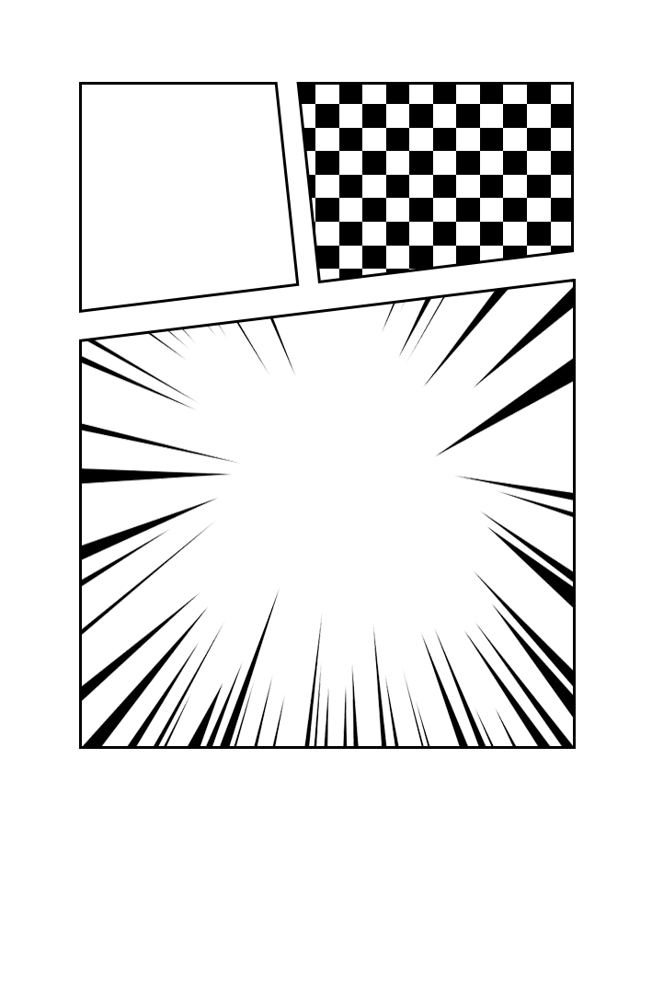

# Tarah (طراح)

<div align="center">

**A professional web-based graphic design and image editing application with full Persian language support**

[](https://vuejs.org/)
[](https://www.typescriptlang.org/)
[](https://fabricjs.com/)
[](https://vitejs.dev/)
[](./LICENSE)
[](https://web.dev/progressive-web-apps/)

</div>

---

## 📋 Table of Contents

- [About The Project](#about-the-project)
- [Features](#features)
- [Tech Stack](#tech-stack)
- [Getting Started](#getting-started)
- [Usage](#usage)
- [Project Structure](#project-structure)
- [Architecture](#architecture)
- [Scripts \& Commands](#scripts--commands)
- [Deployment](#deployment)
- [Contributing](#contributing)
- [License](#license)
- [Acknowledgments](#acknowledgments)

---

## About The Project

Tarah (طراح) is Persian for "Design" — a powerful, browser-based graphic design platform built with modern web technologies. The application provides a comprehensive suite of tools for creating professional graphics, editing images, and designing visual content directly in your web browser.

### Why Tarah?

- **Zero Installation**: Run entirely in your browser without any software installation
- **Persian-First**: Built with native Persian (RTL) language support from the ground up
- **Professional Tools**: Features rivaling desktop design applications
- **Offline Capable**: Progressive Web App (PWA) support with offline functionality
- **AI-Powered**: Advanced background removal using state-of-the-art AI models



---

## Features

### 🎨 Text Effects

Create stunning text effects with built-in presets and customizations:

| Effect      | Description                                                    |
| ----------- | -------------------------------------------------------------- |
| **Neon**    | Glowing neon text effect with customizable color and intensity |
| **Glitch**  | Digital glitch effect with displacement and RGB split          |
| **Echo**    | Layered shadow effect creating depth                           |
| **Outline** | Bold outline with customizable stroke width and color          |

### 🖼️ Image Manipulation

- **Cropping**: Custom crop controls with aspect ratio presets
- **Filters**: Apply filters like brightness, contrast, saturation, and blur
- **Background Removal**: AI-powered background removal using `@imgly/background-removal`
- **Clipping Masks**: 25+ geometric clip path shapes for creative compositions
- **Image Adjustments**: Fine-tune exposure, highlights, shadows, and more

### 📱 Barcode & QR Generation

- **QR Codes**: Generate custom QR codes with embedded logos and colors
- **Barcodes**: Support for multiple barcode formats (EAN-13, Code 128, etc.)
- **Customization**: Customize colors, sizes, and error correction levels

### 🎛️ Canvas Features

- **Layers Panel**: Full layer management with grouping support
- **Undo/Redo**: Command pattern implementation for history management
- **Rulers & Guides**: Precision alignment tools
- **Zoom Controls**: Smooth zoom with scroll wheel support
- **Touch Support**: Optimized for both desktop and tablet use

### 🔧 Additional Features

- **Templates**: Pre-designed templates for common use cases
- **Export Options**: Export designs in PNG, JPEG, SVG, and PDF formats
- **Local Storage**: Automatic saving of work in progress
- **Keyboard Shortcuts**: Comprehensive keyboard navigation

---

## Tech Stack

### Core Technologies

| Technology     | Version | Purpose                                 |
| -------------- | ------- | --------------------------------------- |
| **Vue.js**     | 3.x     | Progressive JavaScript framework        |
| **TypeScript** | 5.x     | Type-safe JavaScript superset           |
| **Vite**       | 5.x     | Next-generation frontend tooling        |
| **Fabric.js**  | 6.x     | HTML5 Canvas engine for graphic editing |

### State Management & UI

| Technology       | Purpose                     |
| ---------------- | --------------------------- |
| **Pinia**        | Vue state management        |
| **Element Plus** | Vue 3 UI component library  |
| **Tailwind CSS** | Utility-first CSS framework |

### Build & Deployment

| Technology  | Purpose                        |
| ----------- | ------------------------------ |
| **Docker**  | Containerization               |
| **Nginx**   | Production web server          |
| **Workbox** | PWA service worker for caching |

### Key Libraries

```
├── @imgly/background-removal    # AI background removal
├── qrcode                        # QR code generation
├── jsbarcode                     # Barcode generation
├── pinia                         # State management
├── element-plus                  # UI components
├── tailwindcss                   # CSS framework
└── sass                          # CSS preprocessor
```

---

## Getting Started

### Prerequisites

Ensure you have the following installed on your system:

- **Node.js**: Version 18.x or higher
- **pnpm**: Version 8.x or higher (preferred) or npm/yarn
- **Git**: For version control

### Installation

1. **Clone the repository**

```bash
git clone https://github.com/your-username/Tarah-en.git
cd Tarah-en
```

2. **Install dependencies**

Using pnpm (recommended):

```bash
cd frontend
pnpm install
```

Or using npm:

```bash
cd frontend
npm install
```

3. **Configure environment variables**

Create a `.env` file in the `frontend` directory:

```bash
cp .env.example .env
```

Example `.env` configuration:

```env
VITE_API_BASE_URL=http://localhost:3000/api
VITE_ENABLE_AI_FEATURES=true
VITE_MAX_UPLOAD_SIZE=10485760
```

4. **Start the development server**

```bash
pnpm dev
```

The application will be available at `http://localhost:5173`

### Configuration

#### Vite Configuration

The project uses a modular Vite configuration in [`frontend/vite.config.mts`](frontend/vite.config.mts):

```typescript
import { defineConfig } from "vite";
import vue from "@vitejs/plugin-vue";
import { resolve } from "path";

export default defineConfig({
  plugins: [vue()],
  resolve: {
    alias: {
      "@": resolve(__dirname, "src"),
    },
  },
  server: {
    port: 5173,
    proxy: {
      "/api": {
        target: "http://localhost:3000",
        changeOrigin: true,
      },
    },
  },
});
```

#### Tailwind CSS

Custom Tailwind configuration in [`frontend/tailwind.config.js`](frontend/tailwind.config.js):

```javascript
/** @type {import('tailwindcss').Config} */
module.exports = {
  content: ["./index.html", "./src/**/*.{vue,js,ts,jsx,tsx}"],
  theme: {
    extend: {
      colors: {
        primary: "#6366f1",
        secondary: "#8b5cf6",
      },
    },
  },
  plugins: [],
};
```

---

## Usage

### Basic Operations

#### Adding Text

1. Click the Text tool in the toolbar
2. Click on the canvas to add text
3. Use the properties panel to customize fonts, sizes, and effects

```typescript
// Example: Adding text programmatically
import { useCanvasStore } from "@/stores/canvas";

const canvasStore = useCanvasStore();
canvasStore.addText("Hello Tarah!", {
  fontFamily: "BYekan",
  fontSize: 24,
  fill: "#000000",
});
```

#### Adding Images

1. Click the Image upload button
2. Select an image from your device
3. Use the cropping tool to adjust

#### Applying Effects

```typescript
// Example: Applying neon effect to selected object
canvasStore.applyEffect("neon", {
  glowColor: "#00ff00",
  glowIntensity: 10,
});
```

### Keyboard Shortcuts

| Key        | Action          |
| ---------- | --------------- |
| `Ctrl + Z` | Undo            |
| `Ctrl + Y` | Redo            |
| `Ctrl + S` | Save            |
| `Delete`   | Delete selected |
| `Ctrl + C` | Copy            |
| `Ctrl + V` | Paste           |
| `+` / `-`  | Zoom in/out     |

### PWA Features

Once installed as a PWA, you can:

- Work offline with cached resources
- Launch from desktop/mobile home screen
- Receive background sync when connectivity returns

---

## Project Structure

```
Tarah-en/
├── frontend/                    # Frontend application
│   ├── public/                 # Static assets
│   │   ├── icons/             # UI icons
│   │   ├── images/            # Image resources
│   │   └── resource/          # Configuration resources
│   ├── src/
│   │   ├── api/               # API service modules
│   │   │   ├── compression/   # Image compression
│   │   │   ├── color/         # Color utilities
│   │   │   ├── file/          # File operations
│   │   │   ├── matting/       # AI background removal
│   │   │   ├── oauth/         # Authentication
│   │   │   └── template/      # Templates API
│   │   ├── app/               # Core application logic
│   │   │   ├── fabricCanvas.ts    # Canvas management
│   │   │   ├── fabricCommand.ts   # Command pattern
│   │   │   ├── fabricControls.ts  # Custom controls
│   │   │   ├── fabricGuide.ts     # Alignment guides
│   │   │   ├── fabricHistory.ts   # History management
│   │   │   ├── fabricHover.ts     # Hover effects
│   │   │   ├── fabricRuler.ts     # Ruler tools
│   │   │   ├── fabricTool.ts      # Tool management
│   │   │   ├── fabricTouch.ts     # Touch handling
│   │   │   ├── keybinding.ts      # Keyboard shortcuts
│   │   │   ├── wheelScroll.ts     # Scroll handling
│   │   │   ├── attribute/         # Attribute utilities
│   │   │   └── instantiation/     # Dependency injection
│   │   ├── assets/             # Static assets
│   │   │   ├── fonts/          # Custom fonts
│   │   │   └── style/          # Global styles
│   │   ├── components/         # Vue components
│   │   │   ├── Base/           # Base UI components
│   │   │   ├── Canvas/         # Canvas-related components
│   │   │   ├── Color/          # Color pickers
│   │   │   ├── Common/         # Shared components
│   │   │   ├── Home/           # Home page
│   │   │   ├── Image/          # Image tools
│   │   │   ├── Layer/          # Layer management
│   │   │   ├── LeftPanel/      # Left sidebar
│   │   │   ├── QRCode/         # QR generation
│   │   │   ├── RightPanel/     # Right sidebar
│   │   │   ├── Setting/        # Settings
│   │   │   ├── Text/           # Text tools
│   │   │   └── TopBar/         # Top navigation
│   │   ├── composables/        # Vue composables
│   │   ├── plugins/            # Vue plugins
│   │   ├── router/             # Vue Router config
│   │   ├── stores/             # Pinia stores
│   │   ├── types/              # TypeScript types
│   │   ├── utils/              # Utility functions
│   │   ├── App.vue             # Root component
│   │   └── main.ts             # Entry point
│   ├── build/                  # Build configurations
│   ├── docs/                   # Documentation
│   ├── Dockerfile              # Development Docker
│   ├── Dockerfile.prod         # Production Docker
│   ├── nginx.conf              # Nginx configuration
│   ├── package.json            # Dependencies
│   ├── tailwind.config.js      # Tailwind config
│   ├── tsconfig.json           # TypeScript config
│   └── vite.config.mts         # Vite config
├── LICENSE                     # MIT License
└── README.md                   # This file
```

---

## Architecture

### Overview

Tarah follows a service-oriented architecture with clear separation of concerns:

```
┌─────────────────────────────────────────────────────────────┐
│                      Presentation Layer                     │
│  ┌───────────┐  ┌───────────┐  ┌───────────┐  ┌──────────┐ │
│  │   Vue     │  │  Element  │  │  Tailwind │  │ Custom   │ │
│  │  Components│  │   Plus    │  │    CSS    │  │  Icons   │ │
│  └─────┬─────┘  └─────┬─────┘  └─────┬─────┘  └────┬─────┘ │
└────────┼──────────────┼──────────────┼──────────────┼──────┘
         │              │              │              │
         ▼              ▼              ▼              ▼
┌─────────────────────────────────────────────────────────────┐
│                       Business Logic                        │
│  ┌──────────────────────────────────────────────────────┐   │
│  │              Pinia State Management                  │   │
│  └──────────────────────────────────────────────────────┘   │
│         │              │              │              │       │
│         ▼              ▼              ▼              ▼       │
│  ┌───────────┐  ┌───────────┐  ┌───────────┐  ┌──────────┐ │
│  │  Canvas   │  │   Layer   │  │   Text    │  │  Image   │ │
│  │  Store    │  │  Store    │  │  Store    │  │  Store   │ │
│  └─────┬─────┘  └─────┬─────┘  └─────┬─────┘  └────┬─────┘ │
└────────┼──────────────┼──────────────┼──────────────┼──────┘
         │              │              │              │
         ▼              ▼              ▼              ▼
┌─────────────────────────────────────────────────────────────┐
│                       Core Services                         │
│  ┌───────────┐  ┌───────────┐  ┌───────────┐  ┌──────────┐ │
│  │  Fabric   │  │DI Service │  │   API     │  │  Cache   │ │
│  │  Canvas   │  │ Container │  │  Layer    │  │  Manager │ │
│  └─────┬─────┘  └─────┬─────┘  └─────┬─────┘  └────┬─────┘ │
└────────┼──────────────┼──────────────┼──────────────┼──────┘
         │              │              │              │
         ▼              ▼              ▼              ▼
┌─────────────────────────────────────────────────────────────┐
│                     Data & Storage                          │
│  ┌───────────┐  ┌───────────┐  ┌───────────┐  ┌──────────┐ │
│  │  Indexed  │  │  Local    │  │  REST API │  │  AI      │ │
│  │     DB    │  │  Storage  │  │           │  │ Services │ │
│  └───────────┘  └───────────┘  └───────────┘  └──────────┘ │
└─────────────────────────────────────────────────────────────┘
```

### Key Architectural Patterns

#### 1. Custom Fabric.js Extensions

The project extends Fabric.js with custom object types:

| Extension | File                                                                          | Purpose                |
| --------- | ----------------------------------------------------------------------------- | ---------------------- |
| `Image`   | [`instantiation/extensions.ts`](frontend/src/app/instantiation/extensions.ts) | Enhanced image objects |
| `Textbox` | [`instantiation/extensions.ts`](frontend/src/app/instantiation/extensions.ts) | Text with effects      |
| `QRCode`  | Custom class                                                                  | QR code rendering      |
| `BarCode` | Custom class                                                                  | Barcode generation     |

#### 2. Dependency Injection System

A custom DI container for managing service dependencies:

```typescript
// Service registration
instantiationService.addSingleton(ICanvasService, CanvasService);
instantiationService.addSingleton(ITextService, TextService);

// Service resolution
const textService = instantiationService.get(ITextService);
```

#### 3. Command Pattern for History

Undo/redo functionality using the command pattern:

```typescript
interface FabricCommand {
  execute(): void;
  undo(): void;
  redo(): void;
}

// Example: Move command
class MoveCommand implements FabricCommand {
  constructor(
    private object: FabricObject,
    private oldPosition: Point,
    private newPosition: Point
  ) {}

  execute() {
    this.object.setPosition(this.newPosition);
  }

  undo() {
    this.object.setPosition(this.oldPosition);
  }

  redo() {
    this.execute();
  }
}
```

#### 4. Store-based State Management

Pinia stores for different application concerns:

| Store     | Purpose                     |
| --------- | --------------------------- |
| `canvas`  | Canvas state and operations |
| `layer`   | Layer management            |
| `tool`    | Active tool selection       |
| `history` | Undo/redo history           |
| `user`    | User authentication         |

---

## Scripts & Commands

### Development

| Command           | Description               |
| ----------------- | ------------------------- |
| `pnpm dev`        | Start development server  |
| `pnpm dev:host`   | Start with network access |
| `pnpm dev:docker` | Start in Docker container |

### Build

| Command              | Description                |
| -------------------- | -------------------------- |
| `pnpm build`         | Production build           |
| `pnpm build:analyze` | Build with bundle analysis |
| `pnpm preview`       | Preview production build   |

### Linting & Formatting

| Command          | Description       |
| ---------------- | ----------------- |
| `pnpm lint`      | Run ESLint        |
| `pnpm lint:fix`  | Fix ESLint errors |
| `pnpm format`    | Run Prettier      |
| `pnpm stylelint` | Run Stylelint     |

### Testing

| Command              | Description     |
| -------------------- | --------------- |
| `pnpm test`          | Run unit tests  |
| `pnpm test:watch`    | Watch mode      |
| `pnpm test:coverage` | Coverage report |

### Docker

```bash
# Development
docker-compose up dev

# Production
docker-compose -f docker-compose.prod.yml up -d
```

---

## Deployment

### Docker Deployment

#### Development Environment

```bash
cd frontend
docker build -t tarah-dev .
docker run -p 5173:80 tarah-dev
```

#### Production Environment

1. Build the production image:

```bash
docker build -f Dockerfile.prod -t tarah-prod .
```

2. Run with docker-compose:

```yaml
# docker-compose.prod.yml
version: "3.8"
services:
  tarah:
    build:
      context: ./frontend
      dockerfile: Dockerfile.prod
    ports:
      - "80:80"
    environment:
      - NODE_ENV=production
    restart: unless-stopped
```

### Nginx Configuration

The production nginx configuration handles:

```nginx
server {
    listen 80;
    server_name tarah.example.com;
    root /usr/share/nginx/html;
    index index.html;

    # Gzip compression
    gzip on;
    gzip_types text/plain application/javascript text/css;

    # PWA Service Worker
    location /sw.js {
        add_header Cache-Control 'no-cache';
    }

    # SPA routing
    location / {
        try_files $uri $uri/ /index.html;
    }
}
```

### PWA Deployment

Configure the manifest in [`public/manifest.json`](frontend/public/manifest.json):

```json
{
  "name": "طراح - Tarah",
  "short_name": "Tarah",
  "start_url": "/",
  "display": "standalone",
  "background_color": "#ffffff",
  "theme_color": "#6366f1",
  "icons": [
    {
      "src": "/icons/pwa-192x192.png",
      "sizes": "192x192",
      "type": "image/png"
    }
  ]
}
```

---

## Contributing

We welcome contributions from the community! Please read our contributing guidelines before submitting PRs.

### Getting Started

1. Fork the repository
2. Create a feature branch: `git checkout -b feature/amazing-feature`
3. Commit changes: `git commit -m 'Add amazing feature'`
4. Push to branch: `git push origin feature/amazing-feature`
5. Open a Pull Request

### Coding Standards

#### Code Style

- **TypeScript**: Strict mode enabled
- **Formatting**: Prettier with standard config
- **Linting**: ESLint + Stylelint
- **Commits**: Conventional Commits format

```bash
# Commit message format
<type>(<scope>): <description>

# Example
feat(canvas): add new neon text effect
fix(layer): resolve grouping issue
docs(readme): update installation steps
```

#### Pull Request Guidelines

1. Ensure all tests pass
2. Update documentation for significant changes
3. Include screenshots for UI changes
4. Follow the existing code style
5. Write meaningful PR descriptions

### Development Workflow

1. **Issue Discussion**: Start by discussing in issues
2. **Branch Naming**: Use `feature/`, `bugfix/`, or `hotfix/` prefixes
3. **Code Review**: At least one approval required
4. **CI/CD**: All checks must pass before merge

---

## License

This project is licensed under the MIT License - see the [LICENSE](LICENSE) file for details.

```
MIT License

Copyright (c) 2024 Tarah Contributors

Permission is hereby granted, free of charge, to any person obtaining a copy
of this software and associated documentation files (the "Software"), to deal
in the Software without restriction, including without limitation the rights
to use, copy, modify, merge, publish, distribute, sublicense, and/or sell
copies of the Software, and to permit persons to whom the Software is
furnished to do so, subject to the following conditions:

The above copyright notice and this permission notice shall be included in all
copies or substantial portions of the Software.

THE SOFTWARE IS PROVIDED "AS IS", WITHOUT WARRANTY OF ANY KIND, EXPRESS OR
IMPLIED, INCLUDING BUT NOT LIMITED TO THE WARRANTIES OF MERCHANTABILITY,
FITNESS FOR A PARTICULAR PURPOSE AND NONINFRINGEMENT. IN NO EVENT SHALL THE
AUTHORS OR COPYRIGHT HOLDERS BE LIABLE FOR ANY CLAIM, DAMAGES OR OTHER
LIABILITY, WHETHER IN AN ACTION OF CONTRACT, TORT OR OTHERWISE, ARISING FROM,
OUT OF OR IN CONNECTION WITH THE SOFTWARE OR THE USE OR OTHER DEALINGS IN THE
SOFTWARE.
```

---

## Acknowledgments

### Technologies & Libraries

- **[Fabric.js](https://fabricjs.com/)** - The powerful HTML5 Canvas library that powers Tarah's design engine
- **[Vue.js](https://vuejs.org/)** - The progressive JavaScript framework
- **[Element Plus](https://element-plus.org/)** - Vue 3 UI component library
- **[Tailwind CSS](https://tailwindcss.com/)** - Utility-first CSS framework
- **[@imgly/background-removal](https://github.com/imgly/background-removal)** - AI-powered background removal

### Design Resources

- Custom Persian fonts (BYekan, IRANSans, and more)
- Professional icon sets and design elements

### Open Source Projects

Inspired by and built upon the work of many open source projects in the web graphics ecosystem.

---

<div align="center">

**Built with ❤️ for the Persian-speaking design community**

_Tarah - طراح_

</div>
